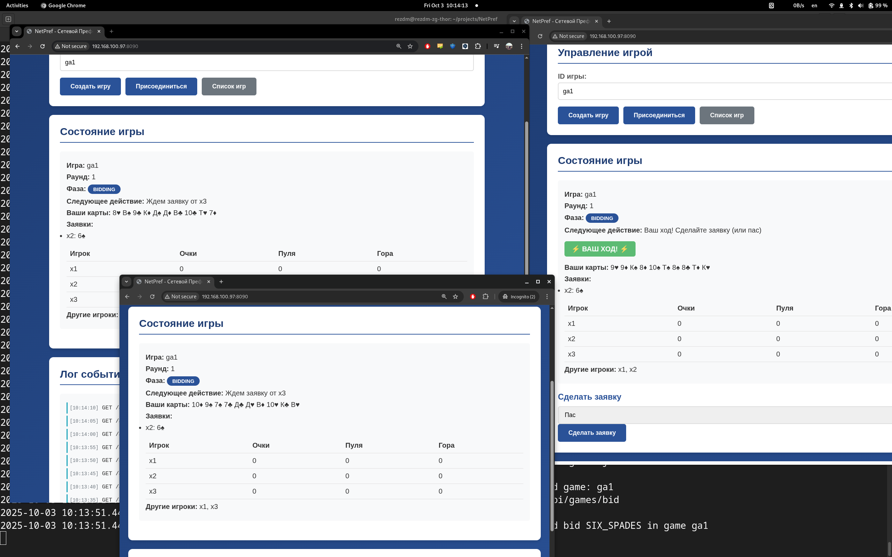
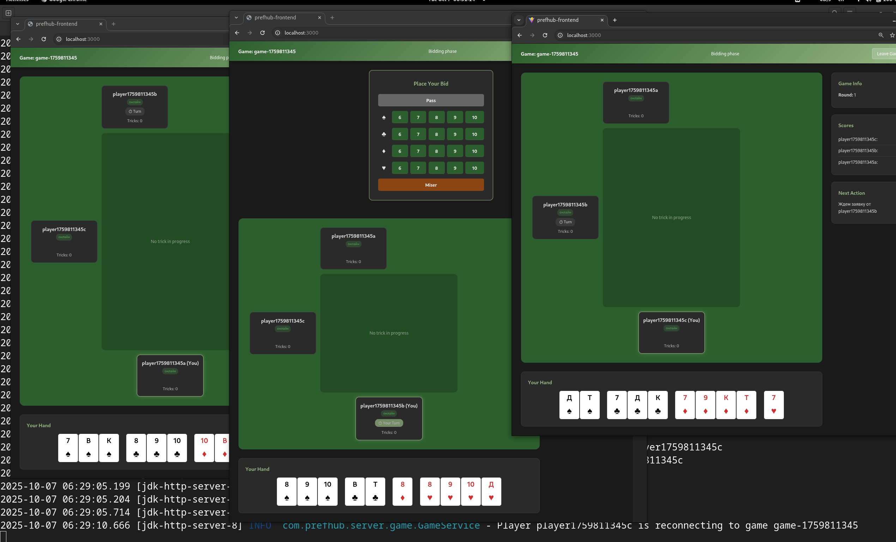

# PrefHub – Сетевой Преферанс
## A bit of history

There’s a card game called Преферанс (Preference, sometimes “Marriage”) that was very popular in the ex-USSR. It’s a relative of Bridge, and you can read more about it here
. Back in the late 90s and early 2000s, a bunch of us in my circle were playing it quite a lot. As people got busy with work, it became harder to meet in person after lectures or seminars, so the idea came up: why not make a way to play online together?

Life happened - friends started spending more time in offices, got married, sadly, one of our friends passed away in a traffic accident, and the project never took off. But the thought of it never fully disappeared.

## Russian
This is actually my first project where the output is in Russian. Normally, I try to keep things in English, but Преферанс really lives in the Slavic world — the terms, the spirit, the language. The English is more like a translation layered on top.

## Project
I put together is just a mock-up, it is nowhere near a ready project. If anybody is interested to pick it up together -- let's do it. 

Cheers!

## Scenario testing
To test possible scenarios (set of rules + initial deal + recorded moves) -- there is are scripts:
- 60-start-server-scenarios.sh -- starts server in script replay mode (loading games with their sets)
- 65-start-client-scenarios.sh -- connecting to server and replaying them
This is sort of end-to-end, regression testing. With this I'd appreciate some help. I need to find recorded (some champtionships?) game protocols, translate them to my datamodel and just let this client to play them through.

## Front-end
With the help of AI, without daily experience with React, started to build the front-end part:

